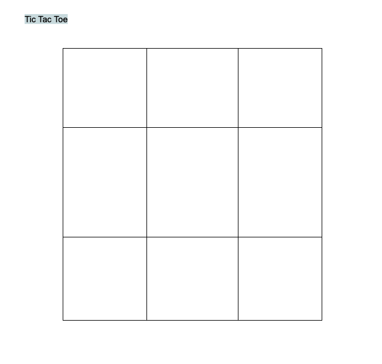

# Tic Tac Toe

## Description

A browser-based Tic Tac Toe game coded in JavaScript, HTML, and CSS.

## Planning Process

### User Stories

### MVP
- As a user, I want a browser-based interface so that I can play the game.
- As a user, I want to place my token so that I can interct with the game.
- As a user, I want the game to reach a win state so that I know who won and can play again.

#### Bronze

#### Silver

#### Gold

- As a user, I want to be able to upload my own image as my token so that I can customize the game.

### Wireframes

